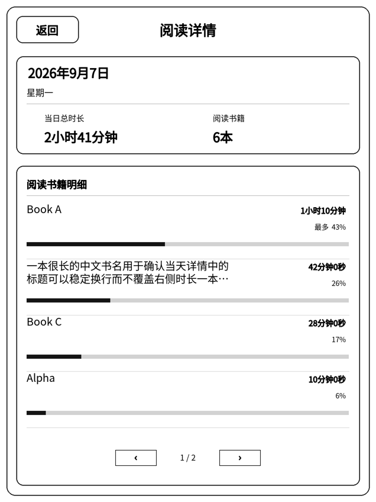

# Kindle Reading Records Enhanced

适用于越狱 Kindle 的原生阅读时长统计插件增强版。当前正式安装版为
[`v9.7.4`](https://github.com/L-1116/kindle-reading-records-enhanced/releases/tag/v9.7.4)，
当前仓库开发版本为 **9.7.5 测试版**，
可在设备上查看月历、阅读热力、周/年统计、月份与最近 8 周趋势、当天阅读详情、
本地书籍封面和单书阅读日历。

本项目基于 [Plutoill/kindle-reading-records](https://github.com/Plutoill/kindle-reading-records)
的代码，经原作者授权后继续迭代。本仓库不是上游项目的官方版本；原始工作归
Plutoill，本仓库中的后续增强和维护由 L-1116 完成。

> 这不是 Amazon 官方项目。安装前请确认 Kindle 已越狱，并至少具备
> SH Integration、KUAL 或 `;log runme` 中的一种可用入口。操作前建议备份
> `/mnt/us/reading-time/`。

## 功能

- 原生阅读器处于前台且屏幕亮起时统计阅读时长，锁屏或离开阅读器后停止。
- 月历按日展示阅读热力，可进入当天书籍明细并分页查看。
- 累计页支持本周、年度与全部历史统计，书籍页支持 7 天、月度、年度和全部历史筛选、本地封面与单书阅读日历。
- 保留真实书籍进度读取、跨午夜拆分、历史数据保护和兼容模式回退。
- 逻辑画布为 1272×1696，并提供等比例缩放和触摸坐标转换。

## 当前正式版本

`9.7.4` 是 9.7.1 之后多轮二级统计、单书分析、封面显示、界面完善和启动器体验升级的正式整合版本，并吸收了 9.7.2 / 9.7.3 测试阶段的功能。月份详情、最近 8 周趋势与单书详情均按需读取 Dashboard 会话缓存；不新增常驻进程，不改变 `reading-time.tsv`，也不联网获取封面。

## 当前开发测试版

### 9.7.5-test.1 公开测试

[`v9.7.5-test.1`](https://github.com/L-1116/kindle-reading-records-enhanced/releases/tag/v9.7.5-test.1) 是 **Pre-release / 公开测试版**，不是正式稳定版。本轮邀请 firmware 5.18.x 和 5.19.x 用户参与，重点验证：

- firmware 5.18 compatibility；
- firmware 5.19 regression；
- 新 installer / uninstaller，以及卸载保留历史、重新安装恢复历史的完整流程。

5.17.x 尚不是本轮正式支持目标。测试原因、安装步骤、8 步测试流程、diagnostic 位置和反馈模板见 [完整公开测试说明](docs/releases/v9.7.5-test.1.md)。发现问题可优先在发布本插件的小红书笔记评论区留言或私信作者，也可以提交 GitHub Issue。

## 界面预览

| 每日时长 | 阅读书籍 | 当天详情 |
|---|---|---|
|  |  |  |

## 安装与回滚

9.7.5 测试包解压到 Kindle USB 根目录后，安装可从三种入口任选其一：

1. 首选：在书库打开 `阅读记录安装`（`documents/reading-records-install.sh`，需要 SH Integration）。
2. 备用：KUAL → 阅读记录 → 安装 / 升级。
3. 兼容旧教程：搜索栏执行 `;log runme`。

三个入口都只调用 `native-reading-time-package/install.sh`。升级保留阅读历史、用户配置与封面缓存；失败诊断写入 `documents/reading-records-diagnostic.txt`，并尽力同时生成 `阅读记录诊断.txt`。5.18 兼容设计和真机清单见 [firmware 5.18 兼容审计](docs/5.18-compatibility.md)。

### 独立安全卸载

在书库打开 `阅读记录卸载`（实际 ASCII 文件名为 `documents/reading-records-uninstall.sh`）。它与“阅读记录安装”是两个独立 Scriptlet；KUAL 中的“卸载程序（保留数据）”也调用同一个 `native-reading-time-package/uninstall.sh` 核心，不包含另一套删除逻辑。

默认卸载会停止 `native-reading-time` 服务，删除阅读记录的 Upstart job、书库启动图标、版本程序、KUAL 扩展、可重建缓存、运行状态和程序日志。它会保留 `reading-time.tsv`、`reading-time.tsv.bak`、`阅读时长统计.txt`、用户配置与所有未被 manifest 明确认定为程序文件的内容；不会修改 jailbreak、Universal Hotfix、MKK、KUAL 本体、MRPI、SH Integration、`;log` 环境或 Amazon 系统服务。

卸载完成后，卸载 Scriptlet 会安全自删并触发最小书库扫描；`reading-records-install.sh`、`RUNME.sh` 与 `native-reading-time-package/` 保留。再次点击“阅读记录安装”即可重装，现有历史继续由未改动的 `reading-time.tsv` 读取。卸载结果及失败诊断分别写入 `documents/reading-records-uninstall-result.txt` 和 `documents/reading-records-uninstall-diagnostic.txt`。

> **安装请务必选对文件：**请从
> [`v9.7.4` Release](https://github.com/L-1116/kindle-reading-records-enhanced/releases/tag/v9.7.4)
> 的 **Assets** 下载 **`kindle-reading-records-v9.7.4.zip`**。
> **不要下载 GitHub 自动生成的 `Source code (zip)` 或 `Source code (tar.gz)`**，它们不是 Kindle 安装包。

1. 下载并解压 [`kindle-reading-records-v9.7.4.zip`](https://github.com/L-1116/kindle-reading-records-enhanced/releases/download/v9.7.4/kindle-reading-records-v9.7.4.zip)。
2. 将 `RUNME.sh` 和完整的 `native-reading-time-package/` 复制到 Kindle USB 根目录。
3. 安全弹出并断开 USB，在 Kindle 搜索栏执行 `;log runme`。

这是完整安装包，同时支持全新安装和旧版原地升级；脚本会自动判断安装路径。9.7.1 用户无需依次安装 9.7.2、9.7.3，也无需重新安装 SH_Integration。

升级和回滚不会主动替换 `reading-time.tsv`。完整步骤和注意事项见
[安装与回滚说明](docs/安装与回滚.md)。

当前 9.7.4 安装包已完成 Kindle 实机测试；此前重点验证机型为 Kindle Paperwhite 6 / 固件 5.19.6，其他机型和固件仍建议自行复核。

## 开发与验证

需要 Python 3.11+、POSIX `sh`/`dash`，以及：

```sh
python -m pip install -r requirements-dev.txt
python scripts/validate_all.py
```

验证结果写入 `build/validation/`，安装包写入 `dist/`，两者均不提交到 Git。
`RUNME.sh`、`documents/`、`extensions/` 与 `native-reading-time-package/` 始终保持可直接解压到 Kindle USB 根目录的结构。

## 版本历史

仓库早期历史由本地发布快照按继承关系重建，每个正式或测试快照都有对应 Git 标签。
提交时间取自原快照目录的修改时间，只用于恢复时间顺序，并非原始开发提交记录。
版本摘要见 [CHANGELOG.md](CHANGELOG.md)。

## 授权说明

本仓库不附加通用软件许可证，也不应被视为向第三方授予复制、修改或再发布代码
的许可。上游代码经原作者明确授权在此发布；如需复用，请分别联系相关权利人。

随包 `NotoSansCJKsc-Regular.otf` 字体仍按 SIL Open Font License 1.1 分发，完整
条款见 `native-reading-time-package/FONT-LICENSE.txt`。
